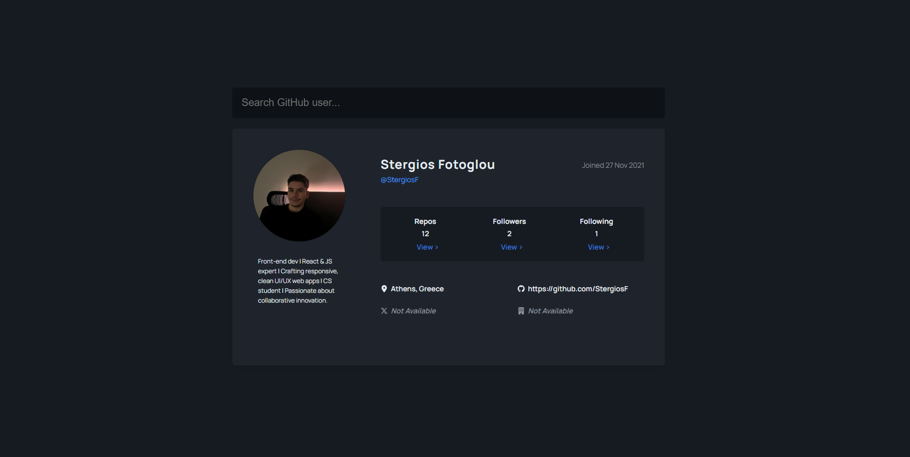

# 🖥️ GitHub Dashboard

A React-based dashboard to explore GitHub user profiles, repositories, and followers using the GitHub API.

## Deployment

Deployed Website: https://github-dashboard-stergios.netlify.app

## About The Project

[](https://github-dashboard-stergios.netlify.app/)

GitHub Dashboard is a comprehensive interface for viewing GitHub user statistics and activity. Features include:

- Dynamic user profile display
- Repository list with sorting (stars, date)
- Follower/Following lists with pagination
- Search functionality with debouncing
- Responsive design for all devices
- Error handling and loading states

### Built With

- [React](https://reactjs.org/)
- [Vite](https://vitejs.dev/)
- [React Router](https://reactrouter.com/)
- [GitHub REST API](https://docs.github.com/en/rest)
- [React Icons](https://react-icons.github.io/react-icons/)

## Getting Started

To get a local copy up and running, follow these simple steps.

### Prerequisites

- Node.js (v18+)
- npm (v9+)
- GitHub Personal Access Token (for API authentication)

### Installation

1. Clone the repo:

   ```bash
   git clone https://github.com/StergiosF/Github-Dashboard
   ```

2. Navigate to the project directory:

   ```bash
   cd github-dashboard
   ```

3. Install NPM packages:

   ```bash
   npm install
   ```

4. Create .env file:

   ```bash
   VITE_GITHUB_TOKEN = your_personal_access_token
   ```

5. Start the development server:

   ```bash
   npm run dev
   ```
